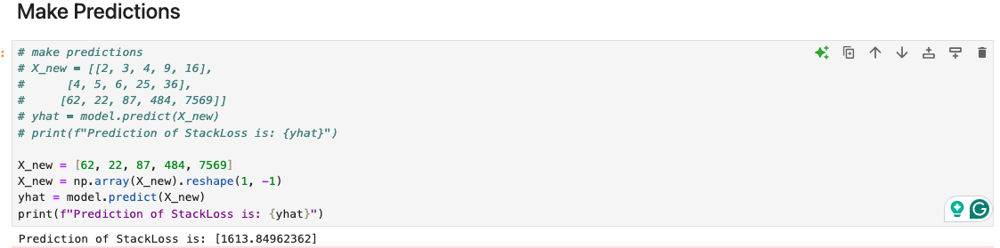
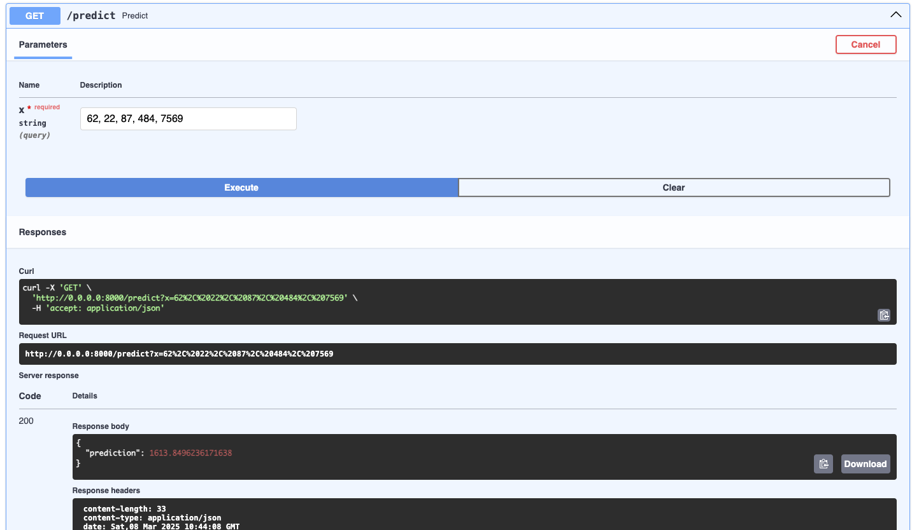
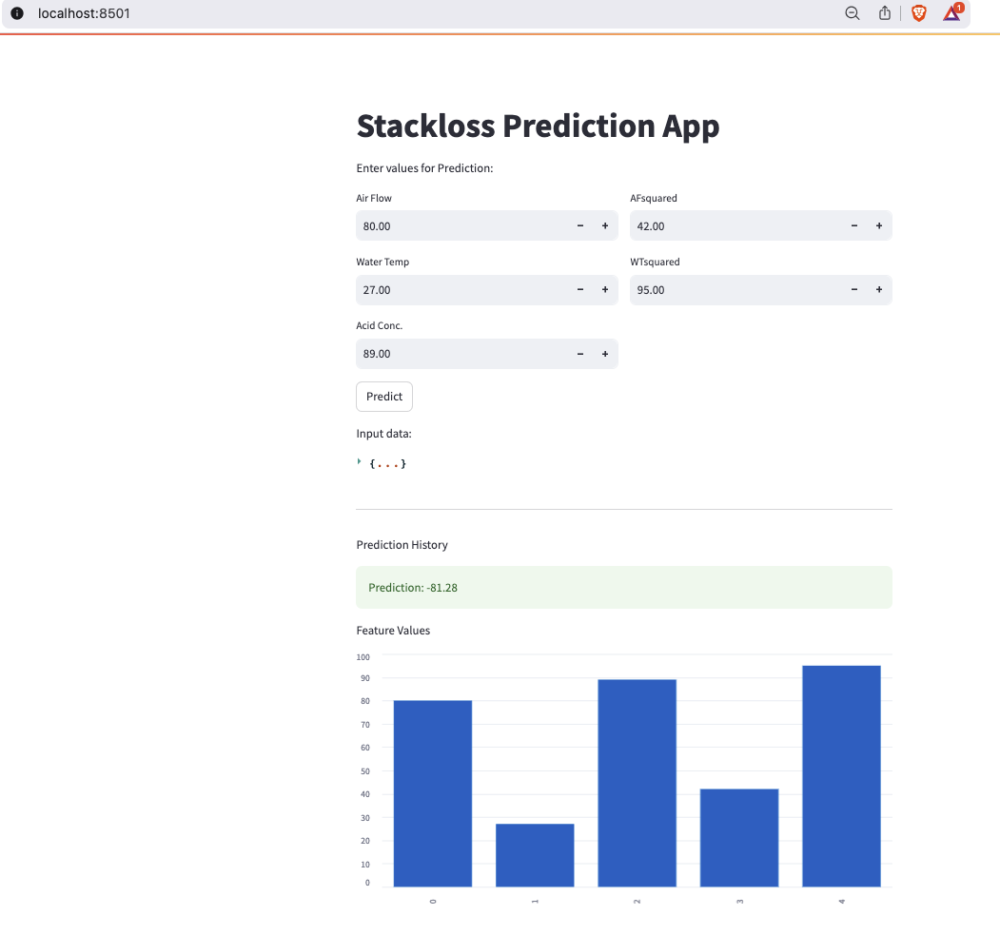

# StackLoss DataSet Using Linear Regression

_Deploying ML Model to Docker Containers_


Notebook: [click link](./q7stackloss.quadratic.ipynb)

---

## Container Deployment Section



### Build the image

```bash
docker build -t berry2012/q7stackloss-quadratic-model:v1 .
```

### Run container locally

```bash
docker network create --subnet 192.168.1.0/24 --driver bridge web_net_1
docker run -d --name api -p 8000:8000 --network=web_net_1 --ip 192.168.1.11 berry2012/q7stackloss-quadratic-model:v1 

export API_URL="http://192.168.1.11:8000"
```

### test the app from the browser

```bash
http://0.0.0.0:8000
http://0.0.0.0:8000/docs
http://localhost:8000/predict?x=80,27,89,42,95
```

Sample prediction

```bash

# format with named data
curl -X POST \
  http://localhost:8000/predict \
  -H "Content-Type: application/json" \
  -d '{"X": [80, 27, 89, 42, 95]}'

```

---

### Accessing the Model API Service at Scale




- Using Another Client Application to consume the API

```bash
python consumer.py
```

- Through a UI App

### Build the image

```bash
docker build -t berry2012/ui-q7stackloss-quadratic-model:v1 .
```

### Run container locally

```bash
docker run -d --name ui -p 8501:8501 --network=web_net_1 --ip 192.168.1.12 berry2012/ui-q7stackloss-quadratic-model:v1 
```

### test the app from the browser

```bash
http://0.0.0.0:8501